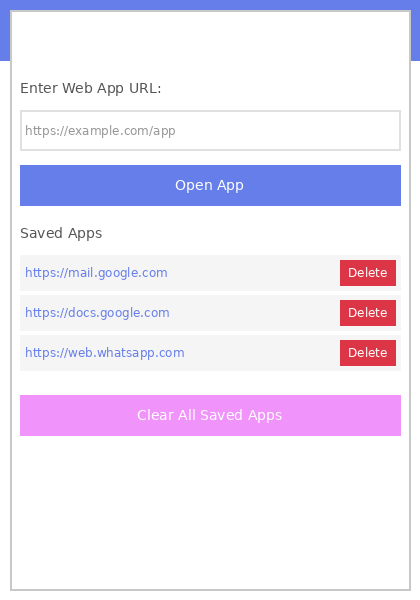

# Web App Reader

A browser extension that runs and hosts web apps as an overlay within the browser. Access your saved web apps directly in an overlay window without leaving your current page.



## Features

- 📱 Run web apps in an overlay within the browser
- 🎨 Beautiful, modern user interface
- 🔒 Secure storage using browser's sync storage
- ⚡ Quick access from browser toolbar
- 🪟 Draggable, resizable overlay window
- 📐 Minimize, maximize, and close controls
- 🎯 Works on any webpage

## Installation

### Chrome/Edge/Brave

1. Download or clone this repository to your local machine
2. Open your browser and navigate to the extensions page:
   - Chrome: `chrome://extensions/`
   - Edge: `edge://extensions/`
   - Brave: `brave://extensions/`
3. Enable "Developer mode" (toggle in the top right corner)
4. Click "Load unpacked"
5. Select the directory containing this extension
6. The Web App Reader icon should now appear in your browser toolbar

### Firefox

1. Download or clone this repository to your local machine
2. Open Firefox and navigate to `about:debugging#/runtime/this-firefox`
3. Click "Load Temporary Add-on"
4. Navigate to the extension directory and select the `manifest.json` file
5. The extension will be loaded temporarily (note: temporary extensions are removed when Firefox is closed)

For permanent installation in Firefox, the extension needs to be signed by Mozilla.

## Usage

1. **Opening Web Apps:**
   - Navigate to any webpage in your browser
   - Click the Web App Reader icon in your browser toolbar
   - Your saved apps will appear in the list
   - Click on any saved app URL to open it in an overlay
   
2. **Using the Overlay:**
   - **Drag:** Click and drag the header to move the overlay
   - **Resize:** Drag the bottom-right corner to resize
   - **Minimize:** Click the minimize button (−) to collapse the overlay
   - **Maximize:** Click the maximize button (□) to fullscreen
   - **Close:** Click the close button (×) to hide the overlay
   
3. **Managing Apps:**
   - Right-click the extension icon and select "Options" to manage your saved apps
   - Add new web app URLs
   - Delete apps you no longer need
   - If no apps are saved, you'll see a "No web app loaded" message

## File Structure

```
Web-App-reader/
├── manifest.json       # Extension configuration
├── popup.html          # Extension popup interface
├── popup.js            # Extension popup logic
├── popup.css           # Extension popup styling
├── content.js          # Content script for overlay injection
├── overlay.css         # Overlay styling
├── options.html        # Options page for managing apps
├── options.js          # Options page logic
├── icons/              # Extension icons
│   ├── icon16.png
│   ├── icon48.png
│   └── icon128.png
└── README.md           # This file
```

## Technical Details

- **Manifest Version:** 3 (latest Chrome extension standard)
- **Permissions:** 
  - `storage` - To save your web app URLs
  - `tabs` - To interact with browser tabs
  - `activeTab` - To inject overlay into active tab
  - `scripting` - To inject content scripts
  - `<all_urls>` - To run overlay on any webpage
- **Storage:** Uses Chrome's sync storage (limited to 10 most recent apps)
- **Overlay:** Uses content scripts and iframe for isolated web app hosting
- **Compatibility:** Works with Chrome, Edge, Brave, and other Chromium-based browsers

## Privacy

This extension:
- Only stores web app URLs you explicitly add
- Does not collect any personal data
- Does not track your browsing activity
- Stores data locally using your browser's sync storage
- Does not send any data to external servers

## License

MIT License - Feel free to use and modify as needed.

## Contributing

Contributions are welcome! Please feel free to submit a Pull Request.
